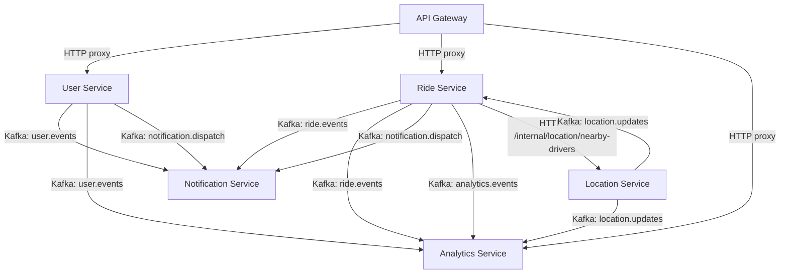

## ADDED Requirements

---

# Cross-Service Dependency Map

This document identifies every feature that requires coordination across more than one service — including which API call or Kafka event is required at each boundary, and which service must be ready first.

---

## Dependency Graph



---

## Feature-Level Dependency Matrix

| Feature | Primary Service | Depends On | Dependency Type | Blocking? |
|---------|----------------|------------|-----------------|-----------|
| Book a ride | Ride Service | — | — | — |
| Driver assignment (cron) | Ride Service | Location Service | HTTP (GET nearby-drivers) | **Yes** — assignment cannot run without location data |
| Driver assignment (cron) | Ride Service | Notification Service | Kafka (`ride.events` → `ride_assigned`) | No — fire and forget |
| Driver assignment (cron) | Ride Service | Analytics Service | Kafka (`analytics.events`) | No — fire and forget |
| Accept / decline ride | Ride Service | Notification Service | Kafka (`ride.events` → `ride_accepted`) | No |
| Complete ride | Ride Service | Notification Service | Kafka (`ride.events` → `ride_completed`) | No |
| Cancel ride | Ride Service | Notification Service | Kafka (`ride.events` → `ride_cancelled`) | No |
| Live ride tracking | Location Service | Ride Service | Kafka (`ride.events` — consumed to start/stop sessions) | **Yes** — Location Service must know when rides go `assigned` / `endtrip` |
| FCM push (ride events) | Notification Service | Ride Service | Kafka (`ride.events`) | No — async consumer |
| FCM push (direct) | Notification Service | Ride Service / User Service | Kafka (`notification.dispatch`) | No — async consumer |
| Password reset email | Notification Service | User Service | Kafka (`user.events` → `password_reset_requested`) | No |
| Dashboard overview | Analytics Service | Ride Service | Kafka (`ride.events`, `analytics.events`) — local read copy | No — eventual consistency |
| Dashboard overview | Analytics Service | Location Service | Kafka (`location.updates`) | No |
| Stale ride cleanup (cron) | Ride Service | — | — | — |
| Daily ride summary (cron) | Analytics Service | Ride Service | Read copy of `riderequests` (Kafka-synced) | No |
| Driver search archival (cron) | Analytics Service | Ride Service | Read copy of `driversearchlogs` (Kafka-synced) | No |
| User device token for FCM | Ride Service | User Service | Phase 1 read copy of `users` collection | **Yes** — Ride Service needs `fcmToken` to include in `ride.events` |
| Station proximity detection | Location Service | Ride Service | Shared `stations` data (Phase 1: Location Service holds a read copy) | **Yes** — Location Service needs station geo-data |

---

## Detailed Dependency Narratives

### 1. Driver Assignment → Location Service (Blocking)

**Feature:** Driver Assignment cron (`processRideRequests`) in Ride Service
**Depends on:** Location Service `GET /internal/location/nearby-drivers`

Ride Service cannot assign a driver without knowing which drivers are geographically closest to the pickup point. It calls Location Service's internal HTTP endpoint synchronously during the cron cycle. If Location Service is unavailable, the cron should log the failure and skip that cycle — it must not crash.

**Contract:**
```
GET /internal/location/nearby-drivers?lat=17.5449&lng=78.5719&radius=3000&limit=10
X-Internal-Service: ride-service

→ 200 [{ "driverId": "...", "distanceMetres": 1200 }, ...]
→ 200 [] (no drivers)
→ 503 (Location Service unavailable — Ride Service skips cycle)
```

**Build order implication:** Location Service geo-index feature must be built and deployed before Ride Service driver assignment cron can be tested end-to-end.

---

### 2. Live Ride Tracking → Ride Service (Blocking)

**Feature:** Live Ride Tracking session management in Location Service
**Depends on:** `ride.events` Kafka topic (produced by Ride Service)

Location Service consumes `ride.events` to know when to open a tracking room (`ride_assigned`) and when to close it (`ride_completed`, `ride_cancelled`). Without this, Location Service cannot correctly manage Socket.io rooms.

**Events consumed:**

| `eventType` | Action in Location Service |
|-------------|---------------------------|
| `ride_assigned` | Open Socket.io tracking room for `rideId`; begin broadcasting driver location to room members |
| `ride_completed` | Close tracking room; emit `ride_ended` to remaining room members |
| `ride_cancelled` | Close tracking room; emit `ride_ended` to remaining room members |

**Build order implication:** Ride Service `ride.events` Kafka production must be working before Location Service tracking session management can be tested end-to-end.

---

### 3. Ride Service → User Service (Phase 1 Read Copy — Blocking for FCM dispatch)

**Feature:** Driver assignment, ride booking, and all events that include `fcmToken`
**Depends on:** `users` collection Phase 1 read copy in Ride Service

Ride Service embeds the commuter's and driver's `fcmToken` in every `ride.events` and `notification.dispatch` Kafka event. To do this, it reads from a Phase 1 copy of the `users` collection.

**Implication:** The `users` read copy in Ride Service must be kept in sync. In Phase 1, both services share the same MongoDB instance, so Ride Service reads directly from the `users` collection owned by User Service. In Phase 2, this becomes a service call.

**Fields read from `users` by Ride Service:**
- `fcmToken` — for push notification dispatch
- `name`, `phone`, `gender`, `image` — copied into `riderequests` at booking time
- `organization`, `shuttleService`, `manualVerification`, `rating`

---

### 4. Notification Service → User Service (Kafka — Non-blocking)

**Feature:** Password reset email
**Depends on:** `user.events` → `password_reset_requested`

User Service publishes `password_reset_requested` to `user.events`. Notification Service consumes it and sends the email. These are decoupled; User Service does not wait for the email to be sent before returning HTTP 200 to the client.

---

### 5. Analytics Service → Ride Service (Kafka read copy — Non-blocking)

**Feature:** Dashboard overview, ride history, daily summary cron
**Depends on:** `ride.events` Kafka topic to keep local `riderequests` read copy up to date

Analytics Service maintains an eventually consistent read copy of `riderequests` by consuming `ride.events`. Dashboard data reflects the last committed state; there is no guarantee of real-time consistency. The `lagWarning` field on dashboard responses surfaces when MongoDB secondary lag is detected.

---

### 6. Station Proximity Detection → Stations Data (Phase 1 Read Copy)

**Feature:** Station proximity check in Location Service
**Depends on:** `stations` collection data owned by Ride Service

Location Service checks whether a driver's current GPS position is within proximity of a known station using `GEODIST` on the Redis geo-index keyed against station coordinates. Station coordinates must be loaded into Location Service on startup.

**Phase 1 approach:** Location Service holds a read copy of the `stations` collection (same MongoDB instance). It caches station coordinates in memory on startup and refreshes on a configurable interval.

---

## Service Boot-Up Order

For a clean local development start, services must be started in this order to avoid dependency errors:

```
1. MongoDB + Kafka + Redis          ← infrastructure
2. User Service                     ← no service dependencies
3. Location Service                 ← no service dependencies (Redis + MongoDB only)
4. Ride Service                     ← depends on Location Service (nearby-drivers API)
5. Notification Service             ← no service dependencies (Kafka consumer only)
6. Analytics Service                ← no service dependencies (Kafka consumer only)
7. API Gateway                      ← depends on all upstream services being reachable
```

Services at the same numbered level can be started in parallel.

---

## Features Safe to Build in Parallel (No Cross-Service Dependency)

These features can be implemented and tested entirely within their own service without waiting for another service:

| Feature | Service |
|---------|---------|
| User registration, OTP, MPIN login | User Service |
| Profile get / update | User Service |
| Vehicle registration | Ride Service |
| Fare configuration (admin) | Ride Service |
| All Kafka consumers | Notification Service, Analytics Service |
| Geo-index maintenance (Redis GEOADD/ZREM) | Location Service |
| All legacy admin HTML dashboards | Analytics Service |
| Daily ride summary cron | Analytics Service |
| Gateway CORS, health, rate limiting | API Gateway |

## Features That Require Cross-Service Coordination Before Testing

| Feature | Blocked Until |
|---------|--------------|
| Driver assignment (cron) | Location Service nearby-drivers API is live |
| Live ride tracking sessions | Ride Service `ride.events` is being produced |
| End-to-end FCM push on ride events | Ride Service events + Notification Service consumer both live |
| Dashboard with real data | Ride Service events flowing into Analytics read copy |
| Password reset email | User Service publishing `password_reset_requested` |
